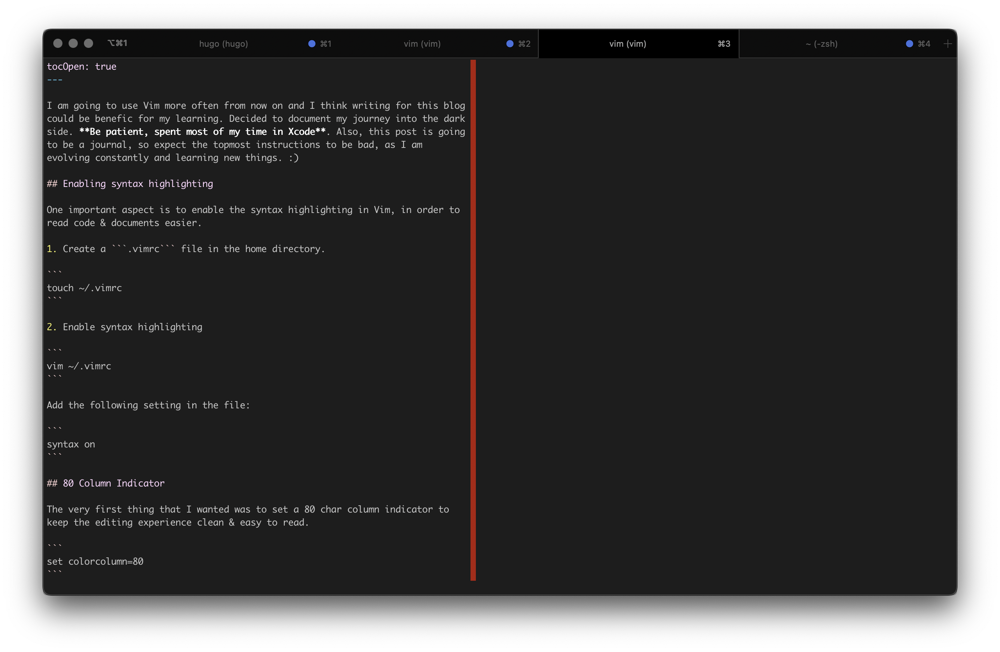

I am going to use Vim more often from now on and I think writing for this blog 
could be benefic for my learning. Decided to document my journey into the dark
side. **Be patient, spent most of my time in Xcode**. Also, this post is going
to be a journal, so expect the topmost instructions to be bad, as I am
evolving constantly and learning new things. :) 

## Enabling syntax highlighting

One important aspect is to enable the syntax highlighting in Vim, in order to
read code & documents easier.

1. Create a ```.vimrc``` file in the home directory.

```
touch ~/.vimrc
```

2. Enable syntax highlighting

```
vim ~/.vimrc
```

Add the following setting in the file:

```
syntax on
```

## 80 Column Indicator

The very first thing that I wanted was to set a 80 char column indicator to
keep the editing experience clean & easy to read.
 
```
set colorcolumn=80
```



Note the red column indicator.
