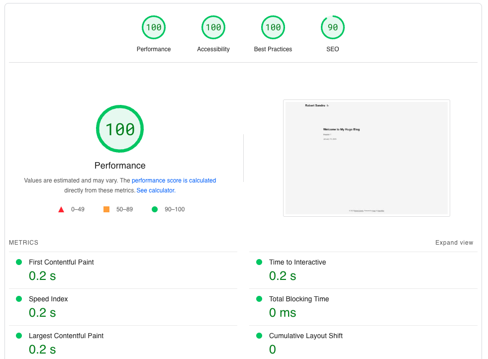

Today is a **big** day in my journey as a software developer. I finally managed
to have a blog up and running **without** the headaches:

- I don't have to pay 350$/yr for a Wordpress blog just because I need
  some basic plugins for SEO
- I don't have to worry about keeping a slow PHP managed Wordpress solution
  up and running. (updating PHP versions, plugins, themes, boilerplate)
- I don't have to worry about making my website faster... constantly.
- I don't have to pay for hosting
- I don't have to pay for themes containing tons of boilerplate

```swift
let isWorrying = false // Love it.
```

After hours of frustration, I realized all I had to do was to answer to some
basic questions before making the right decision:

1. Do I care about my money?
2. Do I need a fully managed solution (users, email campaigns bla bla)?
3. Do I need anything more than markdown to write?
4. Do I need fancy themes & looks?

The answer was no. So, here I am writing an article in markdown, enjoying hot
reload while waiting for Cloudflare to propagate the DNS changes for my custom
domain. I went back into using [Hugo](https://gohugo.io/) and GitHub Pages.

I'm thinking about building a custom Hugo Theme for this site at some point.
Until then, I can focus on writing.

Look at the speed:


