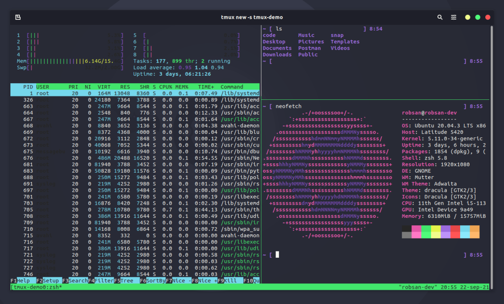
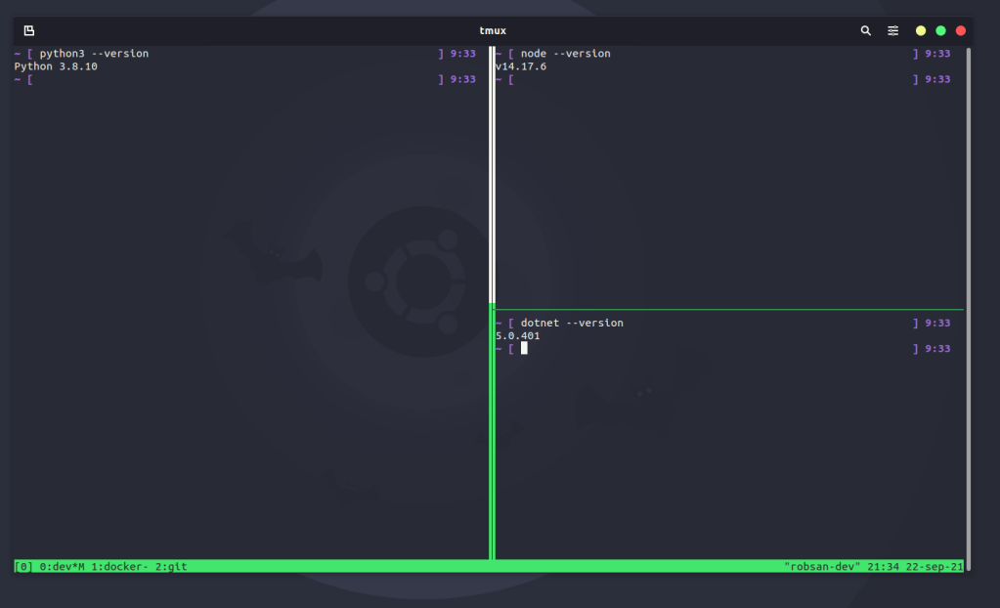

Whether you are new to the terminal or not, using tmux definitely worth it. In a nutshell, tmux is an open source terminal multiplexer that’s going to help you
have multiple terminal sessions in the same window (panes) and also multiple
windows.



Beside it’s mainstream functionality, tmux is also great for keeping sessions
alive so even if you close your terminal, when you reopen it, you are able to
continue your work and recover the session just like you let it.

## Installing tmux

The install process is pretty simple, as tmux is easily settled in your system by using apt.

```bash
sudo apt install tmux
```

## Using tmux

In this article, I decided to only write about what I am actually using while
on tmux. If you want the full reference, follow
[this link](https://github.com/tmux/tmux/wiki) to the official tmux wiki
(GitHub).

| Command                          | Description                                      |
| -------------------------------- | ------------------------------------------------ |
| `tmux new -s tmux-demo`          | Create a new tmux session with the tag tmux-demo |
| `tmux ls`                        | List all tmux sessions                           |
| `tmux kill-session -t tmux-demo` | Kill the session with the tag tmux-demo          |

## Managing Windows and Panes

When you create a new session, you are automatically attached to it. Tmux has a command key (prefix key) that you can access usually by pressing `CTRL + B`.

| Command        | Description                          |
| -------------- | ------------------------------------ |
| `Ctrl+B + %`   | Splits the current pane vertically   |
| `Ctrl+B + “`   | Splits the current pane horizontally |
| `Ctrl+B + c`   | Create a new window                  |
| `Ctrl+B + &`   | Remove the current window            |
| `Ctrl+B + ,`   | Rename the current window            |
| `Ctrl+B + 0-9` | Switch between the windows           |

Notice the 3 windows I created for this picture. We have 3 windows.
(0 – dev, 1 – docker and 2 – git). Currently, I am on the dev window where I
printed the python, node and dotnet versions currently active on my system. In
the docker window, I can manage my containers and in the git window, you name
it… beautiful, clean and organized. Switch between them by using `Ctrl+B+[0-9]`.



You can detach from your tmux session by using `Ctrl+B+d` and come back whenever
you want by using `tmux attach -t <tmux_session_name>`.

tmux has way much more power than that. Please consult the official manual
pages for more functionalities.
